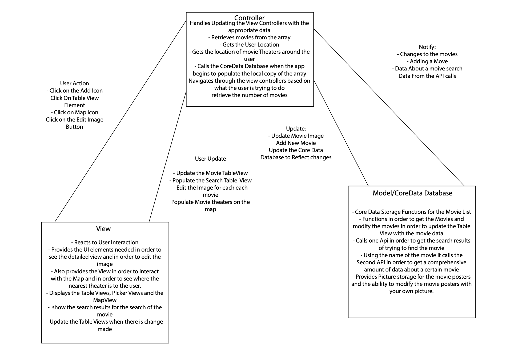
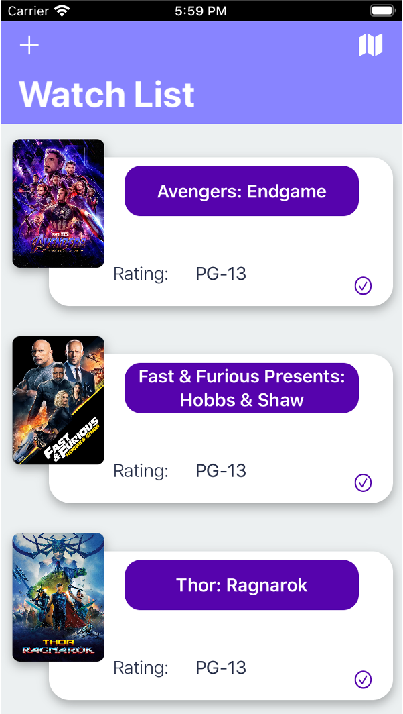
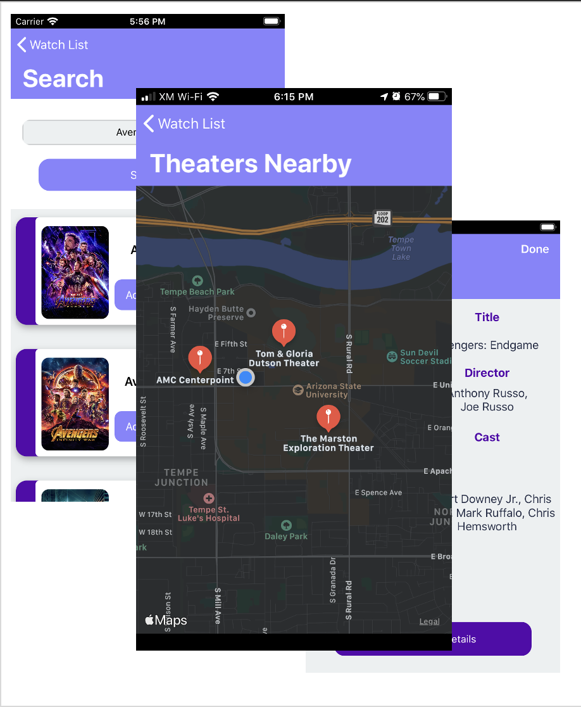

# MovieList
 A comphrehensive Movie Watchlist and Rating App
 
*Note: This repo is cloned from another one of my private repos which is the reason for the singular commit*
 
## Motivations
 
 Searching for movies is hard. You have to go to youtube to find trailers and then you have to go to a movie rating website like IMDB to figure out what the ratings for that movie are and then you have to add it to your reminders so that you dont forget about it. On top of that, if you have kids you have to figure out what the rating of the movie is so that you can feel comfortable with allowing them to watch it.
 
 I created MovieList to Organize my movie and TV show watchlist because my list in my reminders app was getting rather long
 
 ## Tools and Technologies
 - REST API Calls to both the OpenMovieDb API and the IMDB API
 - Swift
 - Core Data
 - Apple Swift Storyboard
 - Model View Controller Application Architecture
 - Apple Photo Library support
 
 
 ## How it works
 
 You search for a movie that you want to watch. The app uses a searching API to find search results to your query even if the name is mispelled. You confirm that you want to add that movie to your watchlist and it will stay there until you finish watching your movie and remove it. In the meantime, the app pulls of information about the movie such as the actors, ratings and the release date.
 
 
 Also for a little extra, if you are looking for a movie theater near you to watch that movie, the app will pull up a map and give you directions to the nearest movie theater
 
 
 ## MVC Architecture Diagram
 
 
 

## Limitations

- The app is using 2 apis that are unrelated to search and get information. If the Movie exists in the first api and doesnt in the 2nd the data may be missing
- There is no support to add movies that arent in the database (no entering custom movies)
 
 
 ## App Design
 
 
 
 
 
 
 
 
 
 
 
 
 
